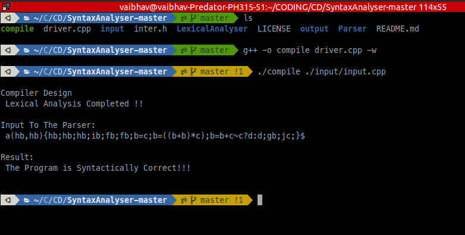

# Syntax Analyser

### Feature Set
* A basic syntax and semantic analyser of C-based programs supporting following features:
  * Data types - ```int```, ```char```
  * Assignments to the variables can be done at the time of declaration.
  * IO  ```get x;```(taking x as input from stdin)\
        ```put x;```(printing x at stdout)
  * Conditional statement syntax:
     ```id = expression ? expression:expression;```
  * Relational Operators supported: {>, <, ~}
  * Arithmetic Operators supported: {+, -, *}
  * Only ```main()``` function is supported. The function may definition may contain arguments and return statement.
  * White-spaces and new lines within statements are ignored.
  * Statements end with **;**
* Steps involved in the construction of the Compiler - 
  * Construction of CFG for the language.
  * Building Lexical Analyser to scan the stream of characters from a program written in above language and generate a stream of tokens to pass to the parser.
  * Building a Bottom-up parser for this language using SLR(1) parsing technique.
---
### File Description
#### CFG
  * `mod.txt`: Map from symbols of the language to letters of CFG
  * `LetterCFG.txt`: CFG grammar productions
  * `augCFG.txt`: Human readable CFG grammar production
  
#### INPUT
  * `input.cpp`: Input file to analyse
  * `keywords.txt`: File for keywords
  
#### OUTPUT
  * `tokens.txt`: Output from Lexical Analyser
  * `DFA_for_Lexical.txt`: DFA states
  * `StatesFile.txt`: Item set created
  * `GoToTransitions.txt`: Goto (I,a) for all item set
  * `Parsing Table.csv`: SLR parsing table
---
### Steps to run
  * Put the file to be analysed in `input.cpp`
  * Open a terminal and go to the project's directory
  * Run command `g++ -o compile driver.cpp -w`
  * Run command `./compile input_file`
  
---
### Output Screenshot

